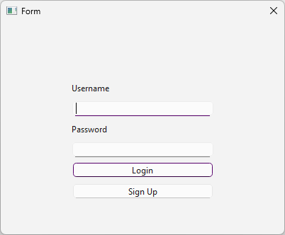
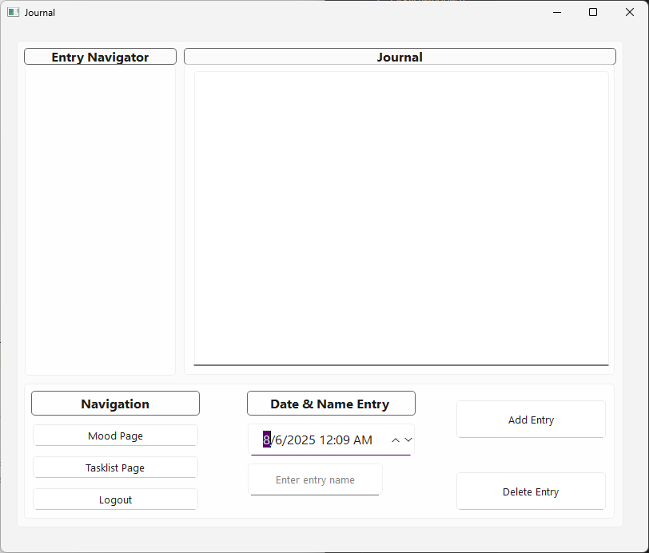
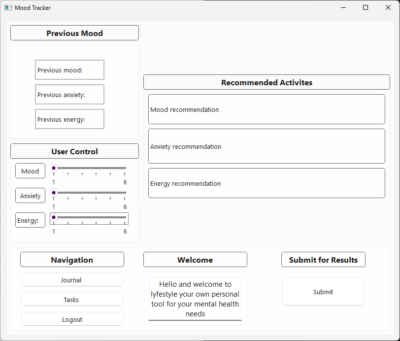
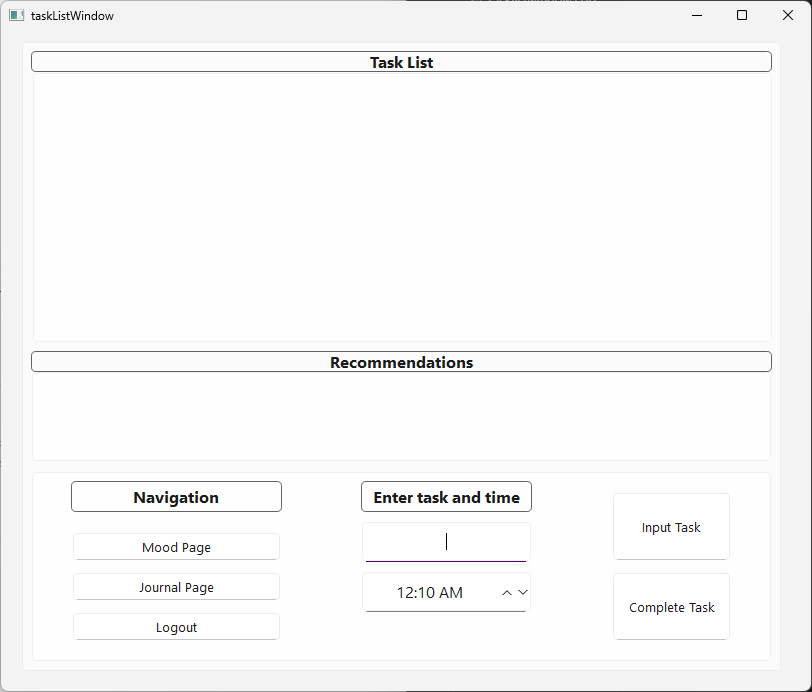

# LyfeStyle

LyfeStyle is a Qt-based desktop application for managing and tracking personal wellness. It includes features for journaling, mood tracking, and task management.


## **Features**

- **Journal System** for personal entries
- **Mood Tracker** to record emotions
- **Task List Mananger** for dialy productivity
- **Secure Login Page**

## Binaries

[Windows](https://github.com/MaxRUnger/370Team8/releases/)


## Building

### Windows Build Requirements

* Qt 6.x and Qt Creator
* Git

### Setup

* Install Qt 6.x SDK and Qt Creator from the  [https://www.qt.io/download-dev](https://www.qt.io/download-dev)
* Install Git from [https://git-scm.com/downloads](https://git-scm.com/downloads)
* Clone the repository using Git:
    ```bash
    git clone https://github.com/MaxRUnger/370Team8.git
    ```
* Open Qt Creator and Select:
    * `File > Open File or Project`
    * Navigate to the `CmakeList.txt` inside the `370Team8` folder.
* Configure the project:
    * Select your Qt 6.x Kit with MinGW  or MSVC (whichever installed with Qt)
    * Click Configure Project
* Build and Run the project
    * `Build > Build project "Lyfestyle"` or `CTRL+B`
    * `Build > Run` or `CTRL+R`

## Screenshots
  
  
  


## Contributors

* Max Unger
* Brody Estes
* Zyrus Tyson
* Kevin Truong